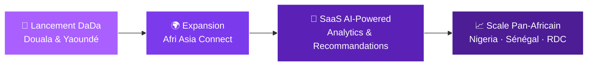

<!-- ANIMATED HEADER -->

<!-- SOCIAL BADGES -->

  

<!-- TYPING EFFECT -->

---

### 🧑‍💻 Qui suis-je ?

Je suis **Jean Calvain DOUMBA** aka **Calvino Pro**, développeur full-stack et entrepreneur tech basé au **Cameroun** 🇨🇲.

Je conçois et développe des **plateformes digitales à fort impact** pour les marchés africains — de l'immobilier au commerce B2B international.

- 🏗️ Je construis **DaDa** (immobilier) et **Afri Asia Connect** (B2B Afrique–Chine)
- 🤖 J'explore l'**AI/ML** pour créer des produits SaaS intelligents
- 🌍 Ma vision : des solutions tech **made in Africa, for Africa**
- 🤝 Ouvert aux **collaborations** et **partenariats stratégiques**
- ✍️ Signature : `Calvino Pro 👌`

 

---

## ⚡ Tech Arsenal

| | Technologies |
|:---:|:---|
| **Frontend** |        |
| **Backend** |      |
| **Data** |      |
| **Cloud & DevOps** |     |
| **Design & Tools** |    |

---

## 🏆 Projets Phares

<table>
<tr>
<td width="50%" valign="top">

<h3 align="center">🏠 DaDa</h3>

<strong>Plateforme de Location Immobilière</strong>

Plateforme immobilière révolutionnaire avec **crédits prépayés** via MTN MoMo / Orange Money, onboarding agences et géolocalisation avancée.

`Laravel 12` `React 19` `Next.js 15` `NestJS` `PostgreSQL + PostGIS` `Redis` `React Native/Expo` `AWS`

**🎯 Villes :** Douala · Yaoundé · Garoua · Ngaoundéré

</td>
<td width="50%" valign="top">

<h3 align="center">🌍 Afri Asia Connect Business</h3>

<strong>Plateforme B2B Afrique — Chine</strong>

Connecte **investisseurs africains** et **fabricants chinois** à prix d'usine. 4 tiers d'abonnement, schéma 22 tables, UI premium dark/light.

`Laravel` `React` `NestJS` `PostgreSQL` `Tailwind CSS`

**🎯 Expansion :** 🇳🇬 Nigeria · 🇨🇮 Côte d'Ivoire · 🇸🇳 Sénégal · 🇨🇩 RDC · 🇬🇭 Ghana

</td>
</tr>
<tr>
<td width="50%" valign="top">

<h3 align="center">🎓 UniDocs</h3>

<strong>Archivage Documentaire Universitaire</strong>

Plateforme d'archivage pour le **système LMD camerounais**. 11 entités PostgreSQL, mockups desktop & mobile (9 écrans chacun).

`Laravel` `React` `PostgreSQL` `Tailwind CSS`

</td>
<td width="50%" valign="top">

<h3 align="center">🏨 Divina Hotel</h3>

<strong>Gestion Hôtelière Complète</strong>

Système complet de gestion hôtelière : réservations, chambres, clients et commandes.

`Laravel` `Vue.js` `MySQL`

</td>
</tr>
</table>

---

## 📊 GitHub Analytics

<!-- CONTRIBUTION GRAPH -->

<!-- TROPHIES -->

---

## 🗺️ Roadmap 2025–2026

---

## 💬 Parlons business

> *"La technologie est l'outil. L'Afrique est l'opportunité. L'impact est la mission."*

 

  

**`Calvino Pro 👌`**

 

<!-- SNAKE ANIMATION -->
<picture>
  <source media="(prefers-color-scheme: dark)" srcset="https://raw.githubusercontent.com/platane/snk/output/github-contribution-grid-snake-dark.svg" />
  <source media="(prefers-color-scheme: light)" srcset="https://raw.githubusercontent.com/platane/snk/output/github-contribution-grid-snake.svg" />
  
</picture>

